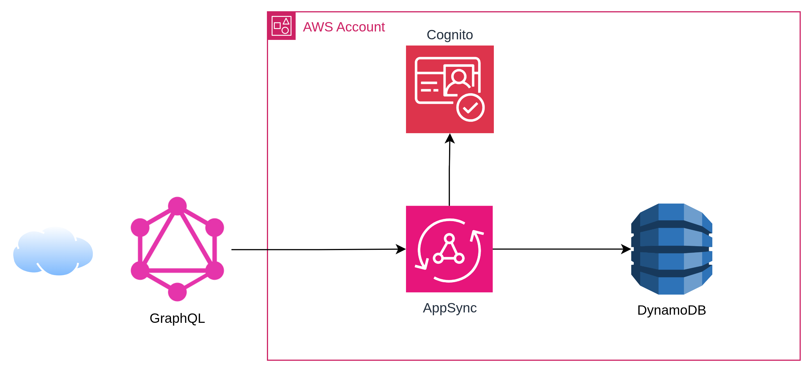

# AppSync + DynamoDB + Cognito (Terraform)

GraphQL API with AWS AppSync that persists directly to DynamoDB, authenticated with Cognito User Pools.

## Architecture

```
Client → Cognito Auth → AppSync (GraphQL) → DynamoDB
```



## Resources created

- **Cognito User Pool + Client** — user authentication
- **AppSync GraphQL API** — GraphQL endpoint with Cognito auth
- **DynamoDB Table** — item storage (PAY_PER_REQUEST)
- **IAM Role** — AppSync → DynamoDB permissions

## Deploy

```bash
terraform init
terraform plan
terraform apply
```

## Usage

### 1. Create a Cognito user

```bash
aws cognito-idp sign-up \
  --client-id <cognito_client_id> \
  --username user@example.com \
  --password MyPass123

aws cognito-idp admin-confirm-sign-up \
  --user-pool-id <cognito_user_pool_id> \
  --username user@example.com
```

### 2. Get token

```bash
aws cognito-idp initiate-auth \
  --client-id <cognito_client_id> \
  --auth-flow USER_PASSWORD_AUTH \
  --auth-parameters USERNAME=user@example.com,PASSWORD=MyPass123
```

Use the `IdToken` from the response as the `Authorization` header in AppSync requests.

### 3. GraphQL Queries

**Create item:**
```graphql
mutation {
  createItem(input: { title: "My first post", content: "Post content" }) {
    id
    title
    content
    createdAt
  }
}
```

**Get item by ID:**
```graphql
query {
  getItem(id: "abc-123") {
    id
    title
    content
    createdAt
  }
}
```

**List all:**
```graphql
query {
  listItems {
    id
    title
    content
    createdAt
  }
}
```

## Quick curl example

```bash
# 1. Get token
TOKEN=$(aws cognito-idp initiate-auth \
  --client-id <cognito_client_id> \
  --auth-flow USER_PASSWORD_AUTH \
  --auth-parameters USERNAME=user@example.com,PASSWORD=MyPass123 \
  --query 'AuthenticationResult.IdToken' --output text)

# 2. Save temperature
curl -s -X POST <appsync_graphql_url> \
  -H "Authorization: $TOKEN" \
  -H "Content-Type: application/json" \
  -d '{"query": "mutation { createItem(input: { title: \"Temperature\", content: \"23.5°C\" }) { id title content createdAt } }"}'

# 3. Get by ID (use the id from the previous response)
curl -s -X POST <appsync_graphql_url> \
  -H "Authorization: $TOKEN" \
  -H "Content-Type: application/json" \
  -d '{"query": "query { getItem(id: \"<id>\") { id title content createdAt } }"}'

# 4. List all items
curl -s -X POST <appsync_graphql_url> \
  -H "Authorization: $TOKEN" \
  -H "Content-Type: application/json" \
  -d '{"query": "query { listItems { id title content createdAt } }"}'
```

## Cleanup

```bash
terraform destroy
```
